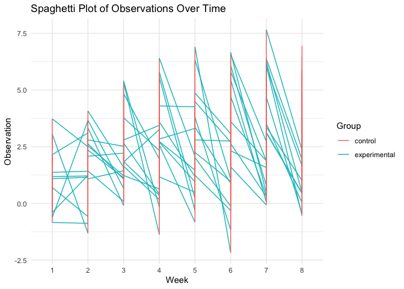

p8105_hw5_anw2158
================
Aung Nay Win

### Problem 1

## Description of The Raw Data

uid: A unique identifier for each homicide incident. reported_date: The
date on which the homicide was reported, in a YYYYMMDD format.
victim_last: The last name of the homicide victim. victim_first: The
first name of the homicide victim. victim_race: The race of the victim.
victim_age: The age of the victim. victim_sex: The sex of the victim,
indicated as Male or Female. city: The city where the homicide occurred.
state: The state where the homicide occurred. lat: The latitude
coordinate of the homicide location. lon: The longitude coordinate of
the homicide location. disposition: The status of the case

``` r
homicide_data = read_csv("./data/homicide-data.csv") |> 
  mutate(city_state = paste(city, state, sep = ", ")) |> 
  group_by(city_state) |> 
  summarise(total_homicides = n(),
            unsolved_homicides = sum(disposition %in% c("Closed without arrest", "Open/No arrest")))
```

    ## Rows: 52179 Columns: 12
    ## ── Column specification ────────────────────────────────────────────────────────
    ## Delimiter: ","
    ## chr (9): uid, victim_last, victim_first, victim_race, victim_age, victim_sex...
    ## dbl (3): reported_date, lat, lon
    ## 
    ## ℹ Use `spec()` to retrieve the full column specification for this data.
    ## ℹ Specify the column types or set `show_col_types = FALSE` to quiet this message.

Proportion Test for Baltimore, MD

``` r
baltimore_data = homicide_data |>  filter(city_state == "Baltimore, MD")

prop_test_baltimore = 
  prop.test(baltimore_data$unsolved_homicides, baltimore_data$total_homicides)
tidy_baltimore = tidy(prop_test_baltimore)
```

Apply prop.test to Each City

``` r
perform_tidy_prop_test = function(unsolved, total) {
  prop_test_result =  prop.test(unsolved, total)
  tidy(prop_test_result)
}

city_test_results = homicide_data |> 
  mutate(prop_test = pmap(list(unsolved_homicides, total_homicides), ~perform_tidy_prop_test(..1, ..2))) |> 
  unnest(prop_test)
```

``` r
ggplot(city_test_results, aes(x = reorder(city_state, estimate), y = estimate)) +
  geom_point() +
  geom_errorbar(aes(ymin = conf.low, ymax = conf.high)) +
  coord_flip() +
  labs(x = "City", y = "Proportion of Unsolved Homicides") +
  theme_minimal()
```

<!-- -->

### Problem 2

``` r
directory_path = "./data/problem2_data"
file_names = list.files(path = directory_path, pattern = "*.csv", full.names = TRUE)
```

``` r
process_file = function(file_name) {
  data = read_csv(file_name)
  
  subject_id = str_extract(file_name, "(?<=con_|exp_)[0-9]+")
  arm = ifelse(str_detect(file_name, "con"), "control", "experimental")
  
  data = data %>%
    mutate(subject_id = subject_id,
           arm = arm)
  
  return(data)
}


participant_data = map_df(file_names, process_file)
```

``` r
tidy_participant_data = participant_data |> 
  pivot_longer(
    cols = starts_with("week"),
    names_to = "week",
    values_to = "observation",
    names_prefix = "week_"
  )
```

``` r
ggplot(tidy_participant_data, aes(x = week, y = observation, group = subject_id, color = arm)) +
  geom_line() +
  labs(title = "Spaghetti Plot of Observations Over Time",
       x = "Week",
       y = "Observation",
       color = "Group") +
  theme_minimal()
```

<!-- -->

Comment on differences between groups

- There is noticeable variability within each group, suggesting that
  individual responses to the conditions are not uniform. This could be
  due to individual differences in how participants react to the control
  and experimental conditions.

- In certain segments of the plot, there seems to be a divergence
  between the two groups, with the experimental group possibly showing a
  different pattern of observations compared to the control group. This
  could indicate an effect of the experimental intervention.

- The beginning and end points of the lines for each group might provide
  insights into the overall impact of the experiment. If the
  experimental group consistently ends at a different point than the
  control group, this could suggest a longitudinal effect of the
  treatment.
