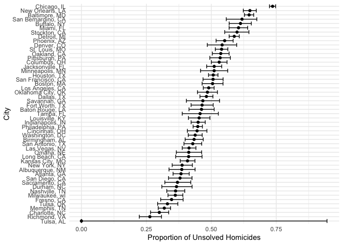

p8105_hw5_anw2158
================
Aung Nay Win

### Problem 1

## Description of The Raw Data

uid: A unique identifier for each homicide incident. reported_date: The
date on which the homicide was reported, in a YYYYMMDD format.
victim_last: The last name of the homicide victim. victim_first: The
first name of the homicide victim. victim_race: The race of the victim.
victim_age: The age of the victim. victim_sex: The sex of the victim,
indicated as Male or Female. city: The city where the homicide occurred.
state: The state where the homicide occurred. lat: The latitude
coordinate of the homicide location. lon: The longitude coordinate of
the homicide location. disposition: The status of the case

``` r
homicide_data = read_csv("./data/homicide-data.csv") |> 
  mutate(city_state = paste(city, state, sep = ", ")) |> 
  group_by(city_state) |> 
  summarise(total_homicides = n(),
            unsolved_homicides = sum(disposition %in% c("Closed without arrest", "Open/No arrest")))
```

    ## Rows: 52179 Columns: 12
    ## ── Column specification ────────────────────────────────────────────────────────
    ## Delimiter: ","
    ## chr (9): uid, victim_last, victim_first, victim_race, victim_age, victim_sex...
    ## dbl (3): reported_date, lat, lon
    ## 
    ## ℹ Use `spec()` to retrieve the full column specification for this data.
    ## ℹ Specify the column types or set `show_col_types = FALSE` to quiet this message.

Proportion Test for Baltimore, MD

``` r
baltimore_data = homicide_data |>  filter(city_state == "Baltimore, MD")

prop_test_baltimore = 
  prop.test(baltimore_data$unsolved_homicides, baltimore_data$total_homicides)
tidy_baltimore = tidy(prop_test_baltimore)
```

Apply prop.test to Each City

``` r
perform_tidy_prop_test = function(unsolved, total) {
  prop_test_result =  prop.test(unsolved, total)
  tidy(prop_test_result)
}

city_test_results = homicide_data |> 
  mutate(prop_test = pmap(list(unsolved_homicides, total_homicides), ~perform_tidy_prop_test(..1, ..2))) |> 
  unnest(prop_test)
```

``` r
ggplot(city_test_results, aes(x = reorder(city_state, estimate), y = estimate)) +
  geom_point() +
  geom_errorbar(aes(ymin = conf.low, ymax = conf.high)) +
  coord_flip() +
  labs(x = "City", y = "Proportion of Unsolved Homicides") +
  theme_minimal()
```

<!-- -->
